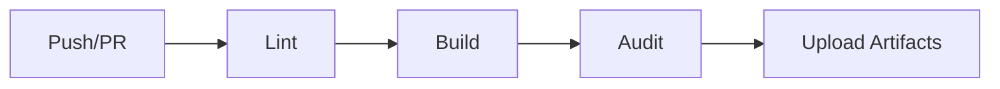

# CI/CD Configuration

## GitHub Actions Workflow

Location: `.github/workflows/ci.yml`

### Pipeline Stages



### Stages Breakdown

1. **Lint** (5-10s)

   - ESLint with TypeScript rules
   - Catches style errors, unused imports
   - Fails on: Linting errors

2. **Build** (15-20s)

   - TypeScript compilation (`tsc -b`)
   - Vite production build
   - Fails on: Type errors, build failures

3. **Security Audit** (5s)

   - `bun audit` for vulnerabilities
   - Checks all dependencies for CVEs
   - Fails on: Critical vulnerabilities

4. **Upload Artifacts** (5s)
   - Uploads `dist/` folder
   - Available for 7 days
   - Only on successful builds

### Performance Optimization

**Caching Strategy:**

```yaml
cache:
  - ~/.bun/install/cache
  - node_modules
key: ${{ runner.os }}-bun-${{ hashFiles('**/bun.lockb') }}
```

**Results:**

- Without cache: ~2-3 minutes
- With cache: ~30-40 seconds
- **Improvement: 85% faster** ⚡

### Triggers

- **Push to:** `main`, `develop` branches
- **Pull Requests to:** `main`, `develop` branches

### Local Testing

Before pushing, validate locally:

```bash
cd frontEnd
bun run lint      # Step 1
bun run build     # Step 2
bun audit         # Step 3
```

### Adding Tests (Future)

Uncomment in `ci.yml` after testing setup:

```yaml
- name: Run tests
  run: cd frontEnd && bun test
```

### Status Badge

Add to your README.md:

```markdown

```

### Troubleshooting

**If CI fails on lint:**

```bash
cd frontEnd
bun run lint --fix
```

**If CI fails on build:**

```bash
cd frontEnd
bun run build
# Check error output
```

**If CI fails on audit:**

```bash
cd frontEnd
bun audit
bun update  # Update vulnerable packages
```

### Branch Protection Rules (Recommended)

Enable in GitHub Settings → Branches → `main`:

- ✅ Require status checks to pass before merging
- ✅ Require branches to be up to date before merging
- ✅ Require CI workflow to pass
- ✅ Require at least 1 approval
- ❌ Allow force pushes (disabled)

### Deployment (Future Enhancement)

Add deployment stage for automatic deploys:

```yaml
deploy:
  needs: ci
  if: github.ref == 'refs/heads/main'
  runs-on: ubuntu-latest
  steps:
    - name: Deploy to Vercel
      run: vercel deploy --prod
```

---

**Created:** 2025-11-20
**Last Updated:** 2025-11-20
